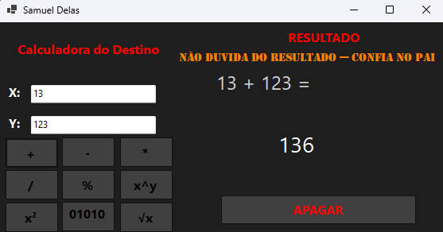
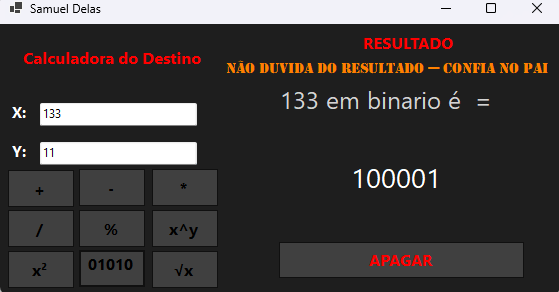
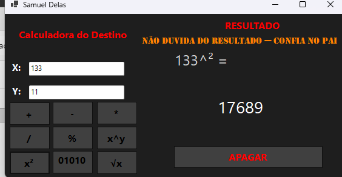

# Win Form Calclator

Este é um simples projeto, feito em Forms com C#, de uma calculadora de operações básicas e comuns.

Telas do programa:

?? Demosntração do programa:

?? Funções extras:
Conversão de decimal para binário:

X elevado a potência de Y:

Baixe a versão do programa [aqui](https://github.com/samueluca/slsf-winforms-calculator/releases/tag/version_1.0) 

